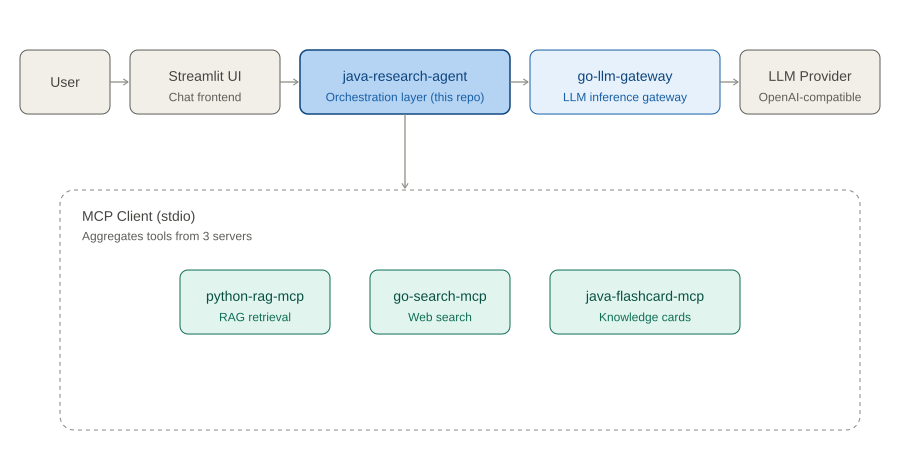

# java-research-agent

[](https://openjdk.org/)
[](https://spring.io/projects/spring-boot)
[](https://spring.io/projects/spring-ai)
[](LICENSE)

一个基于手写 ReAct 循环的自主研究代理（Research Agent）：接收自然语言指令，按需调用 RAG 检索、在线搜索、知识卡片等 MCP 工具，经统一的 Go Gateway 完成 LLM 推理，最终输出结构化回答。

本仓库是整套 AI 工程体系中的**编排层（Orchestration Layer）**，职责边界清晰，只做三件事：**调度 MCP 工具、调用 LLM、管理会话记忆**。检索能力、搜索能力、知识管理能力均以独立 MCP Server 的形式解耦在外部仓库中。

> 该项目是个人 AI 工程作品集的一部分，与 [python-rag-mcp](#)、[go-search-mcp](#)、[java-flashcard-mcp](#)、[go-llm-gateway](#) 共同构成一套遵循 MCP 协议通信的分层技术栈。

---

## 目录

- [核心特性](#核心特性)
- [系统架构](#系统架构)
- [快速开始](#快速开始)
- [REST API](#rest-api)
- [配置](#配置)
- [Chat UI](#chat-uistreamlit)
- [测试](#测试)
- [项目结构](#项目结构)
- [设计文档](#设计文档)

---

## 核心特性

- **手写 ReAct 循环**，而非依赖框架黑盒 —— LLM 每一步以结构化 JSON 输出 `call_tool` / `finish` 决策；`max-steps`、单步与总超时、重复工具调用检测均由业务代码显式强制，不依赖 Spring AI 的隐式 Tool Calling，决策过程完全可控、可审计。
- **MCP 工具编排** —— 通过 MCP Client 聚合 3 个独立 Server 暴露的 5 个工具：`search_knowledge`、`generate_answer`、`web_search`、`createFlashcard`、`listCards`。
- **LLM 调用统一收敛至 Go Gateway** —— 兼容 OpenAI 协议，Agent 自身不持有任何 Provider API Key，职责与密钥管理彻底分离。
- **会话记忆管理** —— 按 `sessionId` 隔离的滑动窗口，默认保留最近 20 条消息。
- **REST + SSE 双模式** —— 单一端点 `POST /api/agent/chat` 同时支持非流式 JSON 响应与 SSE 流式响应。
- **结构化审计日志** —— 每次请求以单行 JSON 写入 INFO 级日志（`[Audit]` 前缀），完整记录逐步决策、工具调用参数与终止原因，便于问题回溯与效果评估。
- **独立 Chat UI** —— 基于 Streamlit 的 Python 前端，对接 REST/SSE API，用于交互式验证与演示。

## 系统架构



请求经 Streamlit UI 进入 java-research-agent，由 ReAct 循环决策是否调用 MCP 工具；LLM 推理统一经 go-llm-gateway 转发，Agent 自身不持有 Provider API Key。三个 MCP Server 通过 stdio 被聚合到同一个 MCP Client 下，对 Agent 呈现为一组可调用的工具。

| 组件 | 版本 | 端口 | 职责 |
| --- | --- | --- | --- |
| Java | 21 | — | 运行时 |
| Spring Boot | 3.5.16 | — | 应用框架 |
| Spring AI | 1.1.8 | — | LLM/MCP 集成层 |
| java-research-agent | — | 8081 | 编排层（本仓库） |
| go-llm-gateway | — | 8080 | LLM 推理统一入口 |
| Chat UI（Streamlit） | — | 8501 | 交互式前端 |

## 快速开始

### 前置依赖

| 依赖 | 说明 | 是否必需 |
| --- | --- | --- |
| JDK 21 | 本机若为其他版本（如 JDK 26），需通过下方脚本钉住 `JAVA_HOME`；Spring Boot 3.5 尚不支持更高版本 | 是 |
| go-llm-gateway | LLM 推理入口，默认监听 `:8080` | 是 |
| python-rag-mcp / go-search-mcp / java-flashcard-mcp | 3 个独立的 MCP Server（stdio 通信） | 否 — 不启动时 Agent 仅提供纯对话能力 |

### 启动

```bash
source scripts/use-java21.sh    # 钉住 JAVA_HOME，避免与本机默认 JDK 冲突
mvn spring-boot:run             # 纯对话模式（不加载 MCP 工具）

# 或加载全部 MCP 工具：
mvn spring-boot:run -Dspring-boot.run.profiles=mcp
```

> 若跳过 `use-java21.sh` 直接构建，`pom.xml` 中的 `maven-enforcer-plugin` 会在构建阶段报错拦截，避免因 JDK 版本不一致导致的隐性问题。MCP 连接配置详见 `application-mcp.yml`。

### 健康检查

```bash
curl http://localhost:8081/actuator/health
```

## REST API

### `POST /api/agent/chat`

非流式 JSON 与 SSE 流式响应共用同一端点，由请求体中的 `stream` 字段区分。

| 字段 | 类型 | 说明 |
| --- | --- | --- |
| `message` | string | 用户消息（必填） |
| `sessionId` | string | 会话 ID；为空时由服务端生成 UUID |
| `stream` | boolean | 是否启用 SSE 流式响应，默认 `false` |

**请求示例**

```bash
curl -X POST http://localhost:8081/api/agent/chat \
  -H 'Content-Type: application/json' \
  -d '{"message":"帮我查一下知识库里的 Transformer 内容"}'
```

**非流式响应示例**

```json
{
  "sessionId": "550e8400-...",
  "answer": "……",
  "terminatedReason": "LLM_FINISH",
  "steps": [
    {
      "stepIndex": 1,
      "action": "call_tool",
      "tool": "search_knowledge",
      "params": { "query": "Transformer" }
    }
  ]
}
```

`terminatedReason` 可能取值：`LLM_FINISH` / `MAX_STEPS` / `TOTAL_TIMEOUT` / `ERROR`。

**流式响应**（请求体设置 `"stream": true`，curl 加 `-N` 参数）

| SSE 事件 | 数据 | 说明 |
| --- | --- | --- |
| `step` | `StepAuditDto` JSON | 每次工具调用时触发 |
| `token` | 文本片段 | 最终答案的增量输出 |
| `done` | `{ "sessionId", "terminatedReason" }` | 流结束标志 |

## 配置

| 环境变量 | 默认值 | 说明 |
| --- | --- | --- |
| `GATEWAY_URL` | `http://localhost:8080` | Go Gateway 地址 |
| `GATEWAY_API_KEY` | `not-needed` | 真实 API Key 由 Gateway 侧注入，Agent 不持有 |
| `AGENT_MODEL` | `deepseek-chat` | LLM 模型名 |
| `RAG_MCP_*` / `SEARCH_MCP_*` / `FLASHCARD_MCP_*` | 本机对应仓库路径 | 三个 MCP Server 的 command/args/env，默认值见 `application-mcp.yml` |
| `DEEPSEEK_API_KEY` / `TAVILY_API_KEY` | — | 透传给 rag-mcp / search-mcp |

Agent 行为参数（步数上限、超时、记忆窗口等）见 `application.yml` 中的 `agent.*` 配置块：`max-steps=10`、`step-timeout-ms=30000`、`total-timeout-ms=90000`、`memory.max-messages=20`。

## Chat UI（Streamlit）

Agent 后端仍为 Java 服务（8081），聊天界面通过独立的 Streamlit 进程对接其 REST/SSE API。

```bash
# 终端 1：启动 Agent
source scripts/use-java21.sh
mvn spring-boot:run -Dspring-boot.run.profiles=mcp

# 终端 2：启动 Chat UI，浏览器打开 http://localhost:8501
./scripts/run-chat-ui.sh
```

可配置的环境变量：`AGENT_API_URL`（默认 `http://127.0.0.1:8081`）、`CHAT_UI_PORT`（默认 `8501`）、`PYPI_INDEX`（pip 镜像源，默认失败时自动回退清华源）。推荐 Python 3.10–3.12；3.13 需搭配较新版本的 streamlit。

<details>
<summary>常见问题：pip 报 <code>No matching distribution found for protobuf</code></summary>

通常是 macOS 官方 Python 未安装 SSL 根证书，任选其一解决：

```bash
/Applications/Python\ 3.13/Install\ Certificates.command   # 运行一次（路径随版本略有不同）
```

或直接重跑安装脚本，其内置了 venv + certifi + 镜像回退逻辑：

```bash
./scripts/run-chat-ui.sh
```

</details>

## 测试

```bash
mvn -q test                        # 默认：无外部依赖，适用于 CI
MCP_INTEGRATION=true mvn -q test   # 集成测试：需 3 个 MCP Server 与 MySQL 就绪
```

## 项目结构

```
├── src/main/java/com/chilly/researchagent/
│   ├── react/     # ReAct 循环、决策解析、Gateway 对话、Prompt 模板
│   ├── tool/      # 工具注册表、启动探针、连通性验证
│   ├── memory/    # 会话记忆（滑动窗口）与长期记忆接口
│   ├── web/       # REST/SSE 入口与 DTO
│   ├── audit/     # 审计日志
│   └── config/    # 配置绑定与启动检查
├── src/main/resources/   # application*.yml、prompts/、static/
├── ui/                   # Streamlit Chat UI
├── scripts/              # use-java21.sh、run-chat-ui.sh
└── docs/                 # 设计与迭代文档
```

## 设计文档

| 文档 | 内容 |
| --- | --- |
| [docs/Design.md](docs/Design.md) | 需求设计与 Iteration 0–5 规划 |
| [docs/Iteration0.md](docs/Iteration0.md) ~ [docs/Iteration5.md](docs/Iteration5.md) | 各迭代实现记录 |
| [docs/tech-choice-java-agent.md](docs/tech-choice-java-agent.md) | 技术选型备忘录 |

---

## License

本项目采用 [MIT License](LICENSE) 开源。
